# Proyecto 2022-02 ARSW PAPER MIND

## Escuela Colombiana de Ingeniería

## Arquitecturas de Software - ARSW PROYECTO

# Autores

* [Deivid Medina](https://github.com/DeividMedina30)

* [Cristian Ruiz](https://github.com/cristian-ruiz-s-ing)

* [Juan Molina](https://github.com/liontama2121)

# Título

## PAPER MIND

#DEFINICIÓN  DEL PROJECTO:

La idea del proyecto nace de obsidian (es una nueva herramienta gratuita para tomar notas), Nuestro valor agregado al proyecto se basa en notas compartidas para diferentes temas, creando una red de notas con temas

Referentes a este mismo

Paper mind  es una  aplicación web  que  permite:

Crear notas  [nodo].

Las  notas  se  pueden compartir con más usuarios que sean invitados por otro usuario.

Esta  API  nos ayuda a organizar ideas para un proyecto personal o empresarial.

#QUE ESTAMOS RESOLVIENDO

En un grupo de trabajo es muy importante tener diferentes ideas y hay personas que tienen varias ideas de un mismo tema esto ayudara a organizar ideas de un mismo tema.

# Repositorios Relacionados.

- Backend Principal

https://github.com/DeividMedina30/ARSW-Project-PaperMind-Backend.git

- Frontend Principal

https://github.com/DeividMedina30/arsw_paper_mind_front.git

Los siguientes repositorios acontinuación son del mismo Frontend, pero debido a problemas que se presentaron toco cambiar a otro repo el frontend.

- Repositorios Relacionados Frontend y Back

# Despliegue del Proyecto.

- Back

- Front

#Diagramas

- ## Casos de Uso Spring Uno

Crear una Biblioteca

 
Como: Usurio 
 
Quiero: Crear una Biblioteca.
 
Para: Llevar un mejor gestionamiento de mis notas.

 

Actualziar una Biblioteca

 
Como: Usurio 
 
Quiero: Actualizar una Biblioteca.
 
Para: Poder cambiar su descripción o su titulo.

 

Crear Nota

 
Como: Usurio 
 
Quiero: Crear una nota.
 
Para: Llevar un mejor gestionamiento de mis apuntes.

 

Actualizar Nota

 
Como: Usurio
 
Quiero: Actualziar una Nota.
 
Para: Cambiar su nombre o su contenido.

 

Arrastrar Nota

 
Como: Usurio
 
Quiero: Arrastrar una nota.
 
Para: Poder organizar mejor mejor mi dashboard.

 

- ## Diagrama de contexto Spring Uno

- ## Diagrama E-R Spring Uno

- ## Diagrama de clases Spring Uno.

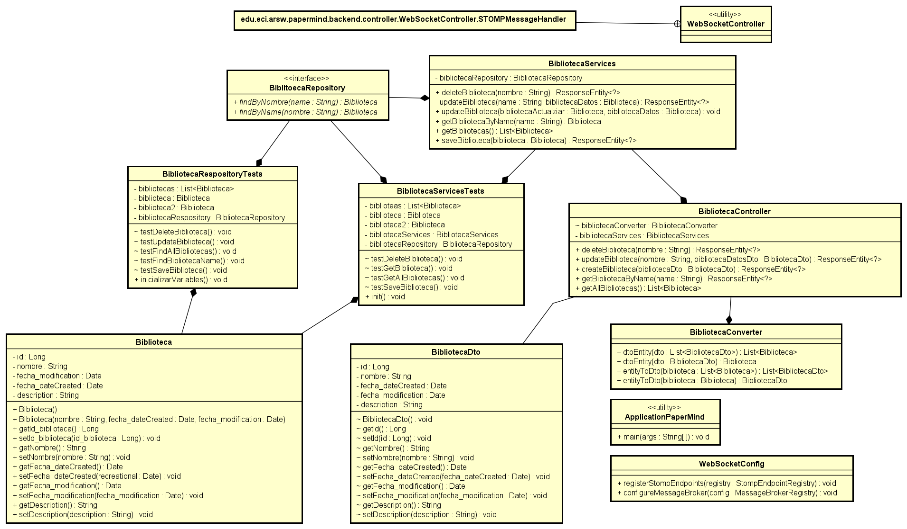

- ## Diagrama de Secuencia Spring Uno

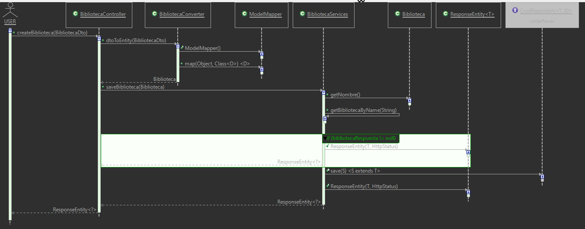

- ## Diagrama de Componentes Spring Uno.

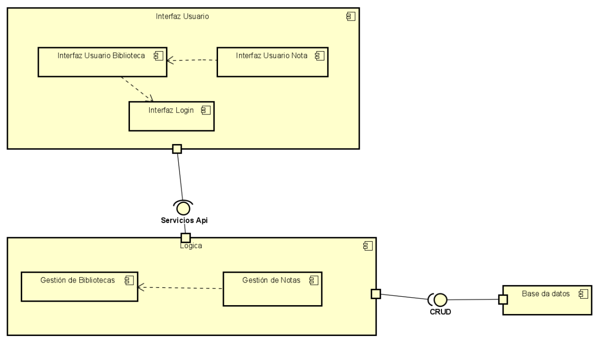

- ## Diagrama de Despliegue Spring Uno.

# Spring Dos

# Escenarios de Calidad

1. Disponibilidad

- Descripción

Cuando se llegan a realizar demasiadas peticiones por parte de diferentes usuarios registrados, el sistema puede ponerse lento o llegar a colapsar.

- Validación del Escenario

   - Origen: La aplicación esta caída o esta lenta con un 70% de cpu.
   - Estimulo: Solicitar un recurso o hacer demasiadas peticiones.
   - Artefacto: Manejador de peticiones en el front como el back.
   - Ambiente: En todo momento.
   - Respuesta: Debe mejorar el rendimiento de la aplicación o levantar nuevamente el sistema.
   - Medida de la respuesta: Crear nueva app servicies en un intervalo de 5 minutos.

2. Seguridad

- Descripción

Posibles ataques como lo son: Ransomware, Inyeccion SQL y DDOS.

- Validación del Escenario

   - Origen: Administrador de acceso.
   - Estimulo: Acceder a la fuerza a un recurso o tratar de robar información.
   - Artefacto: Datos almacenados en la base de datos.
   - Ambiente: Ambiente normal de Ejecución.
   - Respuesta: El sistema posee sistemas de cifrado.
   - Medida de la respuesta: Inmediatamente, no permitir acceso a recursos que no tiene permitido.

3. Mantenibilidad

- Descripción

Se implementa un despliegue continuo de la aplicación en la nube utilizando las herramientas de Azure y SonarQube y además se desarrollan y ejecutan pruebas en la aplicación para verificar su correcto funcionamiento

- Validación del Escenario

   - Origen: Equipo de desarrollo
   - Estimulo: Mejor accesibilidad y diseño a nivel de arquitectura de la aplicación
   - Artefacto: Aplicación Paper - Mind
   - Ambiente: El sistema se debe desplegar para asegurar su disponibilidad y mantenibilidad
   - Respuesta: Debe ser accesible por cualquier usuario que tenga la dirección URL de la aplicación
   - Medida de la respuesta: Este escenario no tiene realmente una medida cuantificable pero se debe evidenciar que no importa cuantos usuarios quieran acceder al sistema o a qué hora específica, este debe estar disponible y el hecho de que esté desplegado en la nube nos debe brindar una mejor mantenibilidad para todo el sistema

# Diagramas Spring Dos.

### Para mayor información consulte el siguiente link: [Diagramas](https://github.com/DeividMedina30/ARSW-Project-PaperMind-Backend/tree/master/Diagramas) 

- ## Casos de Uso Spring Dos.

- ## Diagrama de contexto Spring Dos.

- ## Diagrama E-R Spring Dos.

- ## Diagrama de clases Spring Dos.

- ## Diagrama de Secuencia Spring Dos.

El siguiente diagrama se hizo con ayuda de eclipse y Astah.

Controller.

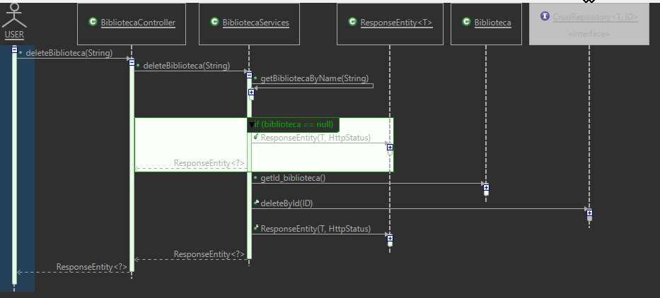

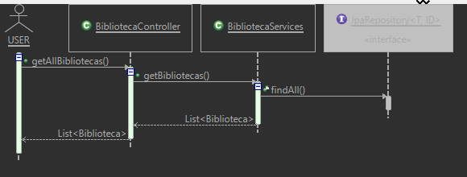

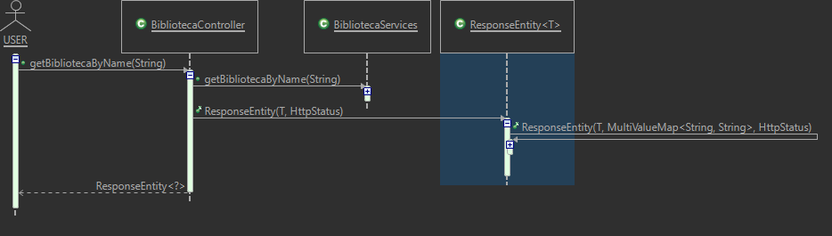

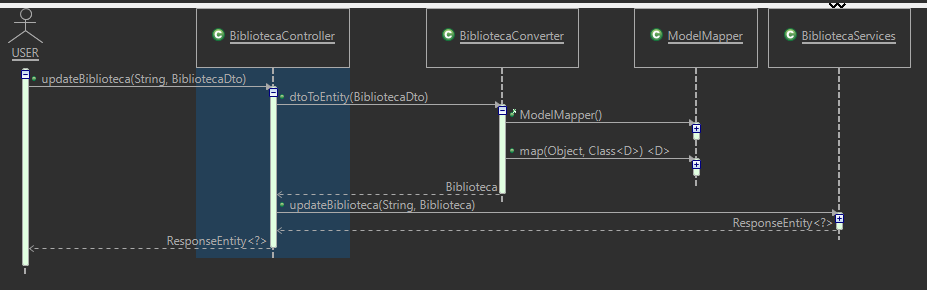

Converter.

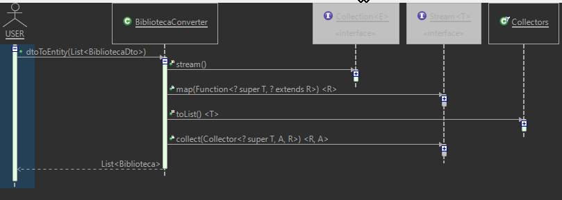

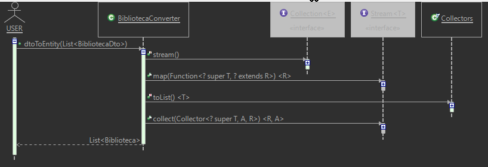

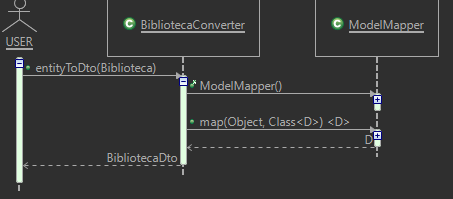

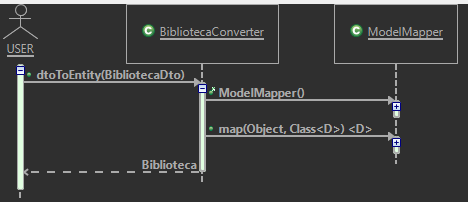

Services.

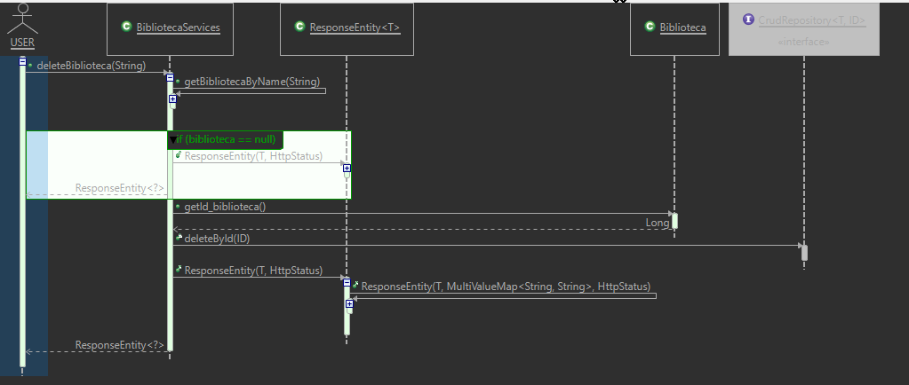

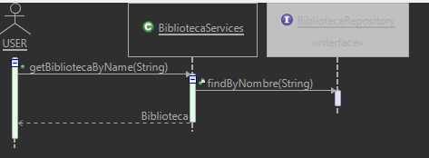

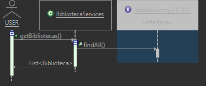

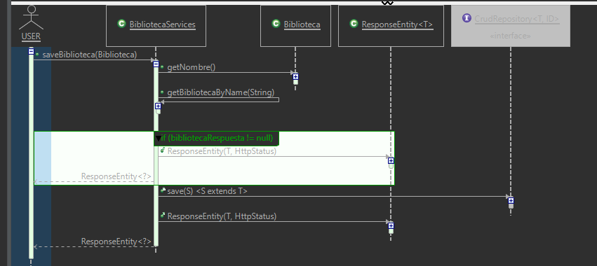

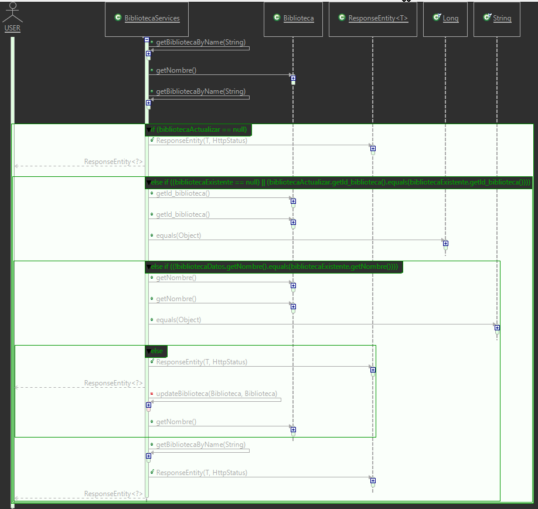

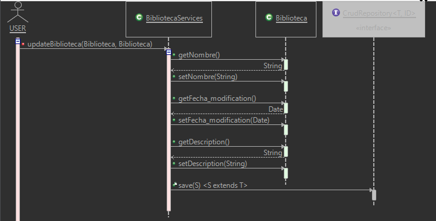

WebSocket.

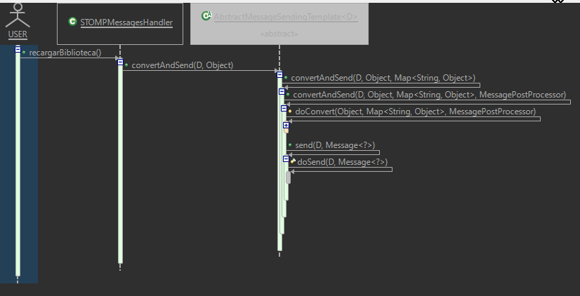

Main

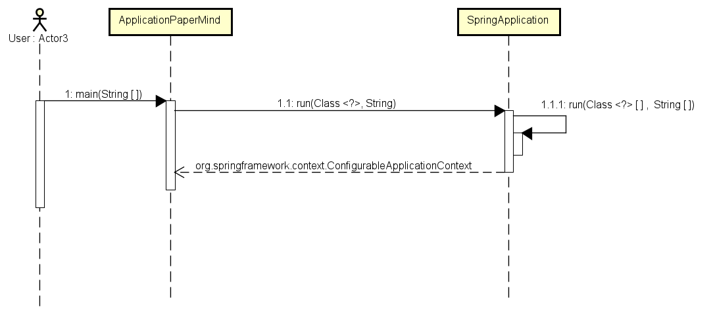

- ## Diagrama de Componentes Spring Dos.

- ## Diagrama de Despliegue Spring Dos.

# Drivers Arquitectónicos

- Restricciones: 
  - Limite de 100 créditos en cuenta azure, debe estar desplegado en la nube tanto back como front.

- Supuestos Arquitectónicos:
  - Como no se especifico si el back debe estar en maquinas virtuales se supone que se puede desplegar en    AppServices.
  - No se especifico que base de datos se debe usar, entonces hacemos uso de sqlServerAzure.
   

### Licencia & Derechos de Autor

Deivid Medina, Cristian Ruiz, Juan Molina, Estudiantes de Ingeniería de Sistemas de la Escuela Colombiana de Ingeniería Julio Garavito

Licencia bajo la [GNU General Public License](/LICENSE.txt)
